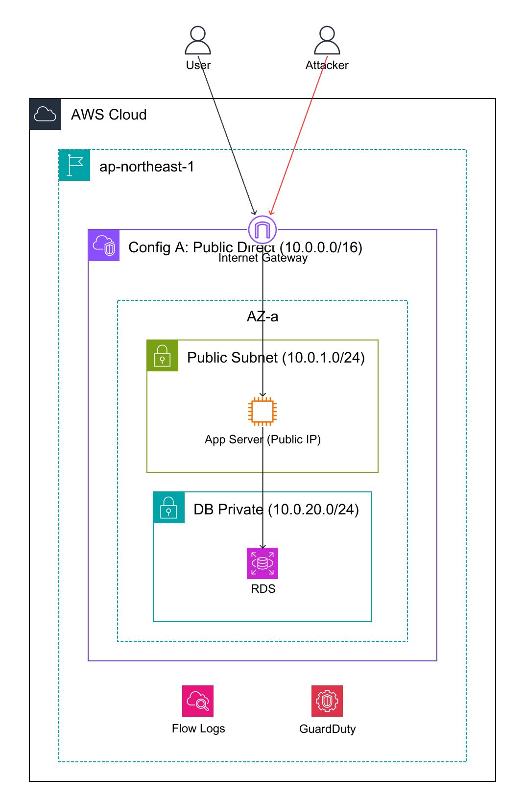
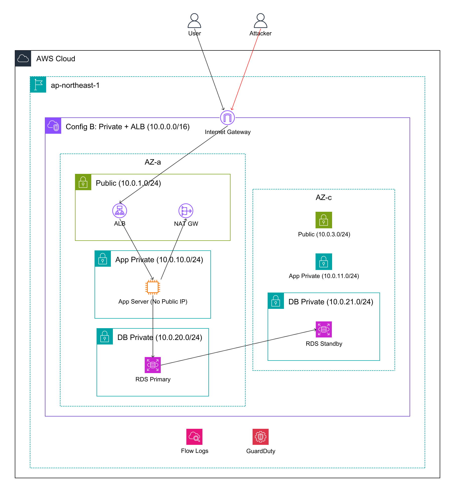

# Architecture

## Purpose

A hands-on lab to compare how security changes between AWS Public Subnet and Private Subnet configurations — same app, same attacks, different network architecture. Toggle a single Terraform variable `config_mode` to switch configurations and observe the causal differences.

## Repository Structure

```
public-vs-private-subnet/
├── README.md                      # Usage & command reference
├── architecture.md                # This file
├── Makefile                       # fmt, lint, setup targets
├── .pre-commit-config.yaml        # Git pre-commit hooks (Terraform, Shell, Python, Markdown)
├── .markdownlint.yaml             # Markdown linting rules
├── .gitignore                     # Exclusions (results/, *.pem, .tfstate, docs/*, tasks/*, etc.)
├── terraform/                     # Infrastructure definitions (Terraform)
│   ├── main.tf                    #   VPC, Subnets, IGW, S3 Gateway Endpoint
│   ├── variables.tf               #   Variable definitions (config_mode, etc.)
│   ├── locals.tf                  #   Local values (config logic, subnet CIDRs)
│   ├── routing.tf                 #   Route tables, associations
│   ├── security_groups.tf         #   Security groups (App, ALB, DB)
│   ├── ec2.tf                     #   EC2 instance, SSH key pair, AMI lookup, user_data
│   ├── alb.tf                     #   ALB + Target Group (Private mode only)
│   ├── nat.tf                     #   NAT Gateway + EIP (Private mode only)
│   ├── rds.tf                     #   RDS PostgreSQL (always present)
│   ├── iam.tf                     #   IAM role with S3/EC2/RDS read + SSM policies
│   ├── monitoring.tf              #   VPC Flow Logs, CloudWatch Log Group, Budget alerts
│   ├── dashboard.tf               #   CloudWatch Dashboard (8 widgets)
│   ├── outputs.tf                 #   Output values (URLs, IPs, SSH commands, costs)
│   ├── versions.tf                #   Terraform/provider version constraints
│   ├── terraform.tfvars.example   #   Configuration template
│   └── templates/
│       └── user_data.sh.tpl       #   EC2 startup script (deploys Flask app)
├── scripts/                       # Attack & analysis scripts
│   ├── _common.sh                 #   Shared helpers (Terraform output caching, colors)
│   ├── 00_reconnaissance.sh       #   Reconnaissance (DNS, OSINT, Shodan simulation)
│   ├── 01_portscan.sh             #   Port scan (nmap or bash /dev/tcp fallback)
│   ├── 02_ssh_probe.sh            #   SSH banner probe & brute-force demo
│   ├── 03_web_scan.sh             #   HTTP header analysis, endpoint discovery
│   ├── 04_ssrf_metadata.sh        #   SSRF → EC2 IMDS credential theft
│   ├── 05_db_probe.sh             #   Direct DB connection attempt
│   ├── 06_outbound_check.sh       #   Outbound communication path check
│   ├── 07_full_kill_chain.sh      #   Full kill chain (recon → exploit → lateral movement)
│   ├── 08_post_exploitation.sh    #   Post-exploitation activity simulation
│   ├── 09_internal_recon.sh       #   Internal network reconnaissance
│   ├── 10_ssrf_internal_recon.sh  #   SSRF-based VPC internal recon
│   ├── 11_iam_privilege_escalation.sh # IAM credential abuse / privilege escalation
│   ├── 12_alb_attacks.sh          #   ALB-specific attacks (Config B only)
│   ├── 13_outbound_c2.sh          #   Outbound C2 channel verification
│   ├── 14_ssrf_to_rds.sh         #   SSRF-based RDS database attack
│   ├── 15_iam_blast_radius.sh    #   Comprehensive IAM blast radius mapping
│   ├── 16_data_exfiltration.sh   #   Data exfiltration channel analysis
│   ├── 17_persistence_check.sh   #   Persistence mechanism feasibility analysis
│   ├── 18_detection_evasion.sh   #   Detection & visibility analysis
│   ├── 19_quantitative_metrics.sh #  Quantitative security metrics collection
│   ├── run_all_attacks.sh         #   Orchestrator (--skip-slow, --only N)
│   ├── compare_results.sh         #   Config A vs B comparison report
│   ├── flow_logs_analyzer.sh      #   VPC Flow Logs analysis
│   ├── trace_attack_flow.sh       #   Attack flow trace visualization
│   └── generate_report.sh        #   Professional security assessment report
├── vulnerable-app/                # Intentionally vulnerable Flask application
│   └── app.py                     #   SSRF-vulnerable /fetch endpoint
├── docs/                          # Documentation (git-ignored except diagram/)
│   ├── design-decisions.md        #   Design decision log
│   ├── hands-on-plan.md           #   Hands-on learning plan
│   ├── packet-flow-trace.md       #   Packet flow analysis
│   ├── diagram/                   #   Architecture diagrams (tracked in git)
│   │   ├── config-a-public.yaml   #     Config A diagram definition
│   │   ├── config-a-public.png    #     Config A diagram image
│   │   ├── config-b-private.yaml  #     Config B diagram definition
│   │   └── config-b-private.png   #     Config B diagram image
│   └── plans/                     #   Planning docs (git-ignored except .keep)
├── tasks/                         #   Project task tracking (git-ignored)
│   └── todo.md
└── results/                       # Attack results (auto-generated, git-ignored)
    ├── configA/                   #   Public configuration results
    └── configB/                   #   Private configuration results
```

### What Is Tracked in Git

| Path | Tracked | Notes |
|------|---------|-------|
| `terraform/` | Yes | Except `.terraform/`, `*.tfstate*`, `*.tfvars`, `*.tfplan`, `.terraform.lock.hcl` |
| `scripts/` | Yes | All attack and analysis scripts |
| `vulnerable-app/` | Yes | Flask application source |
| `docs/diagram/` | Yes | Architecture diagrams (YAML + PNG) |
| `docs/*` (others) | No | `design-decisions.md`, `hands-on-plan.md`, `packet-flow-trace.md`, `plans/` |
| `tasks/` | No | Project task tracking |
| `results/` | No | Attack output (contains live AWS details) |
| `*.pem` | No | SSH private keys |

## Two Configurations

The Terraform variable `config_mode` determines all resource placement.

### Config A: Public Direct (Insecure)

`config_mode = "public"`

App Server placed directly in a Public Subnet with a Public IP. HTTP (80) is open to `0.0.0.0/0`, SSH (22) is restricted to `my_ip`. Maximum attack surface.



**Path**: User/Attacker → IGW → EC2 (directly reachable)

### Config B: Private + ALB (Production-Grade)

`config_mode = "private"`

App Server placed in a Private Subnet with no Public IP. ALB proxies HTTP (80) only. NAT Gateway provides outbound-only internet access.



**Path**: User/Attacker → IGW → ALB (HTTP only) → EC2

## CIDR Design

| Purpose     | AZ-a         | AZ-c         | Notes                                           |
| ----------- | ------------ | ------------ | ----------------------------------------------- |
| Public      | 10.0.1.0/24  | 10.0.3.0/24  | ALB, NAT GW (Config B) / App Server (Config A)  |
| App Private | 10.0.10.0/24 | 10.0.11.0/24 | App Server (Config B)                            |
| DB Private  | 10.0.20.0/24 | 10.0.21.0/24 | RDS Subnet Group                                 |

## Security Group Chain

### Config A

| SG     | Inbound                                   | Notes                      |
| ------ | ----------------------------------------- | -------------------------- |
| App SG | 80 from `0.0.0.0/0`, 22 from `my_ip`     | HTTP open, SSH to own IP   |
| DB SG  | 5432 from App SG                          | SG ID reference            |

### Config B

| SG     | Inbound                | Notes                       |
| ------ | ---------------------- | --------------------------- |
| ALB SG | 80 from `0.0.0.0/0`   | HTTP only                   |
| App SG | 80 from ALB SG        | ALB-only access             |
| DB SG  | 5432 from App SG      | SG ID reference             |

Config B enforces a security group chain (ALB SG → App SG → DB SG), isolating each layer with least-privilege access.

## Resource Switching by config_mode

| Resource           | Behavior                    | Reason                                          |
| ------------------ | --------------------------- | ----------------------------------------------- |
| VPC, Subnets, IGW  | Fixed                       | Foundation. Always present                      |
| S3 Gateway Endpoint| Fixed                       | Free VPC endpoint for S3 access                 |
| Route Tables       | Fixed (routes conditional)  | NAT GW route only in Private mode               |
| EC2 (App Server)   | **Recreated**               | Subnet change forces replacement                |
| ALB + Target Group | **Private only**            | HTTP load balancer                              |
| NAT Gateway + EIP  | **Private only**            | Outbound-only internet access                   |
| RDS                | Fixed                       | Creation takes 10-15 min; kept stable            |
| VPC Flow Logs      | Fixed                       | Continuous log history                           |
| Security Groups    | Fixed (rules conditional)   | Inbound rules differ between Public/Private     |
| CloudWatch Dashboard | Fixed                     | Visualization always available                  |
| Budget Alerts      | Fixed                       | Cost monitoring always active                   |

## Monitoring & Observability

- **VPC Flow Logs** → CloudWatch Logs (1-day retention, 60s aggregation)
- **CloudWatch Dashboard** — 8 widgets: traffic trends (ACCEPT/REJECT), top source/destination IPs, traffic by port, rejected traffic details, external attack detection, packet/byte volume, internal App↔RDS communication
- **Budget Alerts** — Default $5/month threshold, SNS → Email at 80% and 100% (both actual and forecasted)
- **Attack Log Analysis** — `flow_logs_analyzer.sh` / `trace_attack_flow.sh` trace attack patterns in Flow Logs

## IAM Role

The EC2 instance role includes these managed policies (intentionally overly permissive for SSRF demonstration):

| Policy | Purpose |
|--------|---------|
| `AmazonSSMManagedInstanceCore` | SSM Session Manager access (Config B remote access) |
| `AmazonS3ReadOnlyAccess` | S3 enumeration via stolen IMDS credentials |
| `AmazonEC2ReadOnlyAccess` | EC2 enumeration via stolen IMDS credentials |
| `AmazonRDSReadOnlyAccess` | RDS enumeration via stolen IMDS credentials |

IMDS is configured with `http_tokens = "optional"` (IMDSv1 enabled), intentionally allowing SSRF-based credential theft.

## Vulnerable Application

`vulnerable-app/app.py` — Flask app deployed via EC2 user_data.

| Endpoint         | Description                                                                      |
| ---------------- | -------------------------------------------------------------------------------- |
| `/`              | Index page with endpoint listing                                                 |
| `/health`        | Health check (ALB Target Group)                                                  |
| `/info`          | Hostname & private IP                                                            |
| `/fetch?url=...` | **SSRF vulnerable** — fetches arbitrary URLs; exploitable for IMDS access        |

## Attack Surface Matrix

| Attack Layer           | Config A (Public) | Config B (Private) | Mitigation Required                           |
| ---------------------- | ----------------- | ------------------ | --------------------------------------------- |
| Network Boundary       | VULNERABLE        | BLOCKED            | Private Subnet + ALB                          |
| Application Layer      | VULNERABLE        | VULNERABLE         | WAF, SSRF mitigation, secure coding           |
| AWS API Layer          | VULNERABLE        | VULNERABLE         | IMDSv2, least-privilege IAM, aws:SourceVpc    |
| VPC Internal Network   | VULNERABLE        | VULNERABLE         | Micro-segmentation, Network Firewall          |
| ALB Proxy Layer        | N/A               | VULNERABLE         | WAF, host-based routing, HTTPS enforcement    |
| Outbound               | VULNERABLE        | VULNERABLE         | Egress SG restrictions, DNS Firewall, NW FW   |

Private Subnet effectively blocks the network boundary attack vector, but application, IAM, internal network, and outbound layer vulnerabilities remain.

## Development

### Pre-commit Hooks

Configured in `.pre-commit-config.yaml`:

| Tool | Target | Action |
|------|--------|--------|
| `terraform fmt` | `*.tf` | Auto-format |
| `terraform validate` | `*.tf` | Syntax check |
| `shfmt` | `*.sh` | Auto-format (indent 4, case indent, binary newline) |
| `shellcheck` | `*.sh` | Lint (excludes SC2034, SC2086, SC2155) |
| `ruff` | `*.py` | Lint + fix |
| `ruff-format` | `*.py` | Auto-format |
| `markdownlint` | `*.md` | Lint with `.markdownlint.yaml` config |
| trailing-whitespace | all | Trim |
| end-of-file-fixer | all | Ensure newline |
| check-yaml | `*.yaml` | Validate |
| check-added-large-files | all | Prevent large files |

### Makefile Targets

| Target | Description |
|--------|-------------|
| `make setup` | Install pre-commit + formatters/linters |
| `make fmt` | Format + lint all files |
| `make fmt-check` | CI check (fails on diffs) |
| `make fmt-tf` | terraform fmt only |
| `make fmt-sh` | shfmt only |
| `make fmt-py` | ruff format only |
| `make fmt-md` | markdownlint --fix only |
| `make lint` | Lint only (shellcheck, ruff) |

## Key Design Decisions

| Decision | Rationale | Production Note |
|----------|-----------|-----------------|
| RDS is config-independent | Creation 10-15 min, teardown 5-10 min | Prod: Blue/Green deployment |
| Single NAT Gateway | Cost savings (~$32/month) | Prod: NAT per AZ for HA |
| EC2 recreated on config switch | Subnet change forces replacement | Acceptable: stateless app |
| SSH key via TLS provider + local file | Simplifies initial setup | Prod: SSM Session Manager only |
| IMDSv1 enabled | Required for SSRF demonstration | Prod: Enforce IMDSv2 |
| S3 Gateway Endpoint | Free, avoids NAT charges for S3 | Prod: Same pattern |
| 1-day Flow Log retention | Cost optimization for lab | Prod: 30-90 days |
| No RDS backups | Lab environment only | Prod: Enable with retention |

## Cost Estimate

| Configuration       | Estimated Cost                                  |
| ------------------- | ----------------------------------------------- |
| Config A (Public)   | ~$0.03–0.05/hr (EC2 + RDS, varies by region)   |
| Config B (Private)  | ~$0.13–0.17/hr (EC2 + RDS + NAT GW + ALB)      |

Free Tier eligible accounts: EC2 and RDS within free tier (Config A is effectively ~$0/hr). NAT Gateway (~$0.062/hr in ap-northeast-1) and ALB (~$0.024/hr) are the primary cost drivers. Costs vary by region; us-east-1 is ~20-30% cheaper.

## Conclusion

Private subnets are **necessary but not sufficient** for securing AWS workloads.

**What private subnets protect against:**

- Direct port scanning and service enumeration (Network Boundary: BLOCKED)
- SSH brute-force from the internet
- Direct IP-based attacks on the application server

**What private subnets do NOT protect against:**

- Application-layer attacks (SSRF through ALB reaches IMDS and internal services)
- IAM credential abuse (stolen credentials operate at the AWS API layer, transcending VPC boundaries)
- Data exfiltration via outbound channels (NAT Gateway does not restrict egress by default)
- Internal lateral movement within the VPC

**Required complementary controls for production:**

1. **IMDSv2 enforcement** (`http_tokens = "required"`) — mitigates most SSRF-based credential theft (blocks GET-only SSRF; full-method SSRF remains a risk)
2. **Least-privilege IAM + SCPs** — limits blast radius; `aws:SourceVpc` conditions prevent stolen credentials from working outside the VPC
3. **AWS WAF on ALB** — filters malicious HTTP requests before they reach the application
4. **Secrets Manager** — eliminates credentials from user-data and environment variables
5. **Restrictive VPC Endpoint policies** — limits S3/API access scope
6. **Egress filtering** — Security Group egress restrictions, AWS Network Firewall, or DNS Firewall to address the NAT Gateway filtering gap
7. **GuardDuty + CloudTrail** — automated threat detection backed by foundational API audit logs
8. **ALB access logs** — restores attacker IP attribution lost by ALB proxying (VPC Flow Logs only show ALB private IP)
